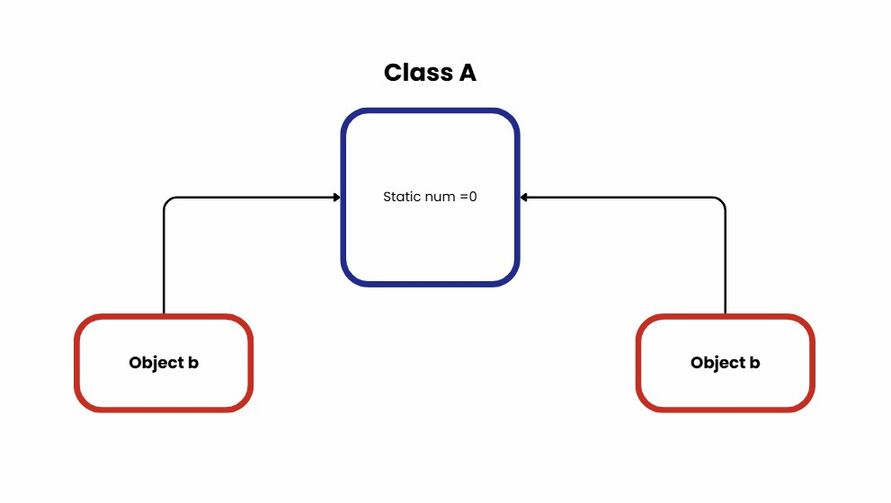

# Static Members

 หลายๆคนอาจจะเคยได้ยินคำว่า Static ในการเขียนโปรแกรมมาก่อน และอีกหลายๆคนอาจจะยังไม่เคยได้ยิน ก่อนอื่นเลยเรามาเริ่มทำความรู้จักกับคำว่า Static  เป็นสิ่งที่ใช้ได้กับตัวแปร และเมธอดของคลาส คุณสมบัติหลักๆขอStatic สามารถเข้าถึงได้ด้วยไม่ต้องสร้างobject สามารถเรียกใช้งานเมธอดผ่านคลาส ตัวแปรที่เป็น static จะผูกเข้ากับคลาสจะถูกแชร์ให้กับobject คลาสเดียวกัน ตัวอย่างเช่น 
 >
 
 > กำหนดให้ class A เป็นคลาสที่มีตัวแปร static num มีค่าเป็น 0  จากนั้นเราสร้าง object b และ c ดังนั่น  b และcใช้ตัวแปร num ร่วมกัน


>
>
static ในแต่ละภาษาก็จะมีความแตกต่างกัน เช่นในภาษา C กับjava จะมี keywordในการบอกว่าเป็นstatic โดยใช้ “static” นำหน้าชื่อเมธอดหรือชื่อตัวแปร 
แต่ในภาษา Python และ Ruby ไม่มี keyword 
เราจะเรียนรู้เกี่ยวกับ static member ในภาษา Ruby กันซึ่ง static member จะมี 2 แบบ คือ

### 1.Static variable หรือ class varialbes
คลาสที่มีตัวแปรโดยทั่วไปจะเป็นตัวแปรของคลาส จะถูกเรียกว่า static variable เมื่อ static variable ถูกประกาศเป็น static พื้นที่สำหรับมันถูกแบ่งไว้สำหรับ lifetime ของโปรแกรม การตั้งชื่อตัวแปรของคลาสจะขึ้นต้นด้วย @@  ข้อมูลที่เก็บใน class variables จะถูกเเชร์ให้กับทุก object ของ class
>
>
```Ruby
class A
  @@num = 0   # ตัวแปร class variable เริ่มต้นที่ 0

  def get
    @@num      # คืนค่าของ @@num
  end

  def set
    @@num = @@num + 1   # เพิ่มค่า @@num ทีละ 1
  end
end

c = A.new   # สร้าง instance c
b = A.new   # สร้าง instance b

b.set       # เรียก b.set → @@num = 0 + 1 = 1
puts "c value: #{c.get}"
puts "b value: #{b.get}"
```
<details>
  <summary>Output</summary>

  > c value: 1  
  > b value: 1  

</details>
จากตัวอย่างจะเห็นว่า object b ทำการอัพเดพค่าเเต่กลับส่งผลต่อตัวเเปร num ของ object c นั้นเสดงให้เห็นว่า b เเละ c ใช้ตัวเเปรnumร่วมกัน
>
>
>
>
### 2.Static method หรือ class method
เมธอดที่สามารถเรียกผ่านคลาสได้เลยไม่ต้องสร้าง object ใน  Ruby จะให้	keyword  “self.” ตามด้วยชื่อmethod เพื่อให้เมธอดสามารถถูกเรียกได้ผ่านclass 
>
>
```Ruby
class A
  @@num = 0   # ตัวแปร class variable เริ่มต้นที่ 0

  def self.get
    @@num      # 
  end

  def set
    @@num = @@num + 1   # เพิ่มค่า @@num ทีละ 1
  end
end
b=A.new 
b.set
puts " value by static method : #{A.get}"
 
```

ผลลัพธ์ที่ออกมาตรงกับconcept ของ static method คือสามารถเรียกใช้เมธอดผ่านคลาสได้ ในตัวอย่างคือเรียกใช้เมธอดผ่าน คลาสA เเละจะเห็นว่าเราอัพเดทค่าของ
คลาสผ่าน b จึ่งทำให้ output มีค่าเป็น 1 ดังตัวอย่าง
>
>
เราลองมาใช้ static meber ใน Java
### Java
```java
        class A {

            private static int num = 0;// ตัวแปร class variable เริ่มต้นที่ 0

            public static int get() {
                return num; //คืนค่าของ num
            }

            
            public void set() {
                num = num + 1;
            }
        }

        public class Main {
            public static void main(String[] args) {
                A b = new A();  
                b.set();        

                System.out.println("value by static method : " + A.get());
            }
        }
```

<details>
  <summary>Output</summary>

  > value by static method : 1 

</details>

### ตัวอย่าง Python
```python
    class A:
        num = 0   

        @classmethod
        def get(cls):   
            return cls.num

        def set(self): 
            A.num = A.num + 1


    # การใช้งาน
    b = A()
    b.set()  

    print("value by static method :", A.get())

```

<details>
  <summary>Output</summary>

  > value by static method : 1 

</details>


### ตัวอย่าง C
```C
 #include <stdio.h>


static int num = 0;


int get() {
    return num;
}

// instance method b.set() → ฟังก์ชัน set()
void set() {
    num = num + 1;
}

int main() {
    // object b = A.new → ใน C ไม่มี object แต่เราจำลองด้วยการเรียก set()
    set();  

    printf("value by static method : %d\n", get());

    return 0;
}

```

<details>
  <summary>Output</summary>

  > value by static method : 1 

</details>


#####  เราลองเรียก static method ผ่าน object 

### ตัวอย่าง Java
```java
       class A {

            private static int num = 0;// ตัวแปร class variable เริ่มต้นที่ 0

            public static int get() {
                return num; //คืนค่าของ num
            }

            
            public void set() {
                num = num + 1;
            }
        }

        public class Main {
            public static void main(String[] args) {
                A b = new A();  
                b.set();        

                System.out.println("value by static method : " + A.get());
                System.out.println("value by b  : " + b.get());
            }
        }
```

<details>
  <summary>Output</summary>

  > value by static method :  1  
  > value by b  :  1  

</details>

>
>
> เราลองมาใช้กับ Ruby
```Ruby
    class A
    @@num = 0   # ตัวแปร class variable เริ่มต้นที่ 0

    def self.get
        @@num      # คืนค่าของ @@num
    end

    def set
        @@num = @@num + 1   # เพิ่มค่า @@num ทีละ 1
    end
    end
    b=A.new 
    b.set
    puts " value by static method : #{A.get}"
    puts "value by b : #{b.get}"
```

<details>
  <summary>Output</summary>

  > Error จร้าาา
  

</details>

>
> 

<details>
  <summary>Click Me</summary>

  >เเล้วเราจะทำยังให้มันสามารถใช้งานได้เหมือนกับ่java เฉลยอยู่ block ถัดไป
 

</details>

```Ruby
    class A
    @@num = 0   # ตัวแปร class variable เริ่มต้นที่ 0

    def self.get
        @@num      # คืนค่าของ @@num
    end
    def get
        @@num      # คืนค่าของ @@num
    end
    def set
        @@num = @@num + 1   # เพิ่มค่า @@num ทีละ 1
    end
    end
    b=A.new 
    b.set
    puts " value by static method : #{A.get}"
    puts "value by b : #{b.get}"
```

<details>
  <summary>Output</summary>

  > value by static method :  1  
  > value by b  :  1  

</details>

จากตัวอย่างของตัวอย่างโค้ดจะเห็นว่าใน class A มี method ที่มีชื่อเหมือนกัน 2อันคือ get เเล้วมันต่างกันยังไง
get ที่เกิดจาก self.get เป็น classs method ที่ต้องเรียกผ่าน class เเละ get ที่ต้องเรียกผ่าน object ถ้าไม่self. 
จะถือว่าเป็น  instace method  อัตโนมัติเป็นที่ต้องเรียกผ่าน object

